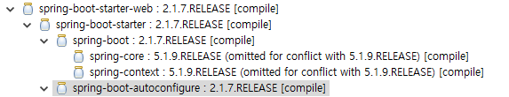

# spring boot – 01. spring boot starter 만들기


작성중…

spring boot 에서 내가 만든 starter를 사용하여 app을 개발한다.
Maven기준

### 1. 기본 spring boot app

Spring boot는 spring-boot-starter-parent를 parent로 지정하여 프로젝트를 구성한다.
parent의 pom.xml파일을 보면 dependency들만 모아놓은 프로젝트를 parent로 다시 지정하고 있고 해당 파일을 열어보면 Spring boot에서 미리 정의해둔 라이브러리 들에 대한 버전이 명시되어있다.

다시 spring-boot-starter-parent에서 사용되는 pom.xml파일을 보면 application설정파일 경로 설정, 플러그인설정등이 들어있다.

소스에서는 아래처럼 설정하면 spring boot application을 구동할 수 있다.

```java
@SpringBootApplication
public class App {
   public static void main(String[] args) {
        SpringApplication.run(App.class, args);
    }
 }
```


중요한 부분은 `@SpringBootApplication` annotation으로 해당 annotation내부로 들어가보면 다음과 같이 설정되어있다.

```java
@SpringBootConfiguration
@EnableAutoConfiguration
@ComponentScan(excludeFilters = { @Filter(type = FilterType.CUSTOM, classes = TypeExcludeFilter.class),
@Filter(type = FilterType.CUSTOM, classes = AutoConfigurationExcludeFilter.class) })
public @interface SpringBootApplication {
...
```


`@SpringBootApplication` annotation안에는 자동설정과 component scan에대한 내용이 포함되어있다.

**`@SpringBootConfiguration`**
해당 annotation이 정의되어 있는 클래스에 `@Bean` Annotation이 있음을 Spring 컨테이너에 알린다. 즉 의존성을 자동으로 관리할 수 있도록 한다.
annotation내부로 들어가보면 `@Configuration`이 정의되어있는 것을 확인 할 수 있다. SpringBootConfiguration annotation은 구성을 자동으로 찾을 수 있게 해준다.
여기서 Configuration annotation 이 적용되어있는 클래스는 component scan을 통해 자동으로 인식해 준다.
설정파일을 추가하고자 할 경우 Congfiguation annotation을 추가한다.

**`@EnableAutoConfiguration`**
Spring boot auto-configuration을 수행한다.
dependency에 추가된 jar들을 대상으로 자동으로 설정을 진행한다.
spring-boot-starter가 dependency로 포함이 되어있을 경우 boot에서 사용되는 autoconfigure가 자동으로 수행된다. 메이븐의 dependency 구조를 보면 아래와 같음을 확인할 수 있다.



자동으로 autoconfig를 수행하는 목록은 해당 jar파일내에 META-INF/spring.factories 파일에 목록화 되어있다.
해당 jar파일에서 아무 configuration파일(e.g. `SpringApplicationAdminJmxAutoConfiguration.class`)을 열어보면 Bean들을 만들고 있는 내용을 볼 수 있다.

**`@ComponentScan`**

### 2. spring boot starter만들기

- spring-boot-autoconfigure, spring-boot-autoconfigure-processor 의존성 추가
- 생성할 bean만들기
- Configuration만들기
  `@Bean` annotation을 이용하여 bean으로 생성한다.
- META-INF/spring.factories에 auto configure 클래스 정의하기
- 프로퍼티에서 값을 가져와 할당하고자 할때에는 `@ConfigurationProperties`, `Configuration`클래스에서 `@EnableConfigurationProperties`(ConfigirationProperties가 적용된 클래스명.class) 를 적용하여 사용한다.(매개 변수로 받아 사용한다.)
  이때 spring-boot-configuration-processor 의존성이 필요하다.

### 3. spring boot starter와 app에서 `@Bean`으로 생성한 객체와의 관계(우선순위)

bean을 생성할때 우선순위가 있다.

1. ComponentScan으로 검색된 bean이 먼저 등록된다.
2. 그다음 auto configure에 있는 bean이 등록된다.

이러한 상황에서 bean생성시 앞에 설정된 bean을 덮어 쓸 수도 있기 때문에 내가 만든 bean을 사용하고자 할 경우에는 optional하게 등록 하게 한다.
`@Bean`으로 bean 생성시 `@ConditionalOn` 으로 시작 하는 annotation을 추가하여 조건에 따라 bean생성을 컨트롤 할 수 있다.
`@ConditionalOn` annotation 의 종류는 아래와 같다.
(https://docs.spring.io/spring-boot/docs/current/reference/html/boot-features-developing-auto-configuration.html)
Class Conditions

@ConditionalOnClass
@ConditionalOnMissingClass

Bean Conditions

@ConditionalOnBean
@ConditionalOnMissingBean

Property Conditions

@ConditionalOnProperty

Resource Conditions

@ConditionalOnResource
e.g. file:/home/user/test.dat

Web Application Conditions

@ConditionalOnWebApplication
@ConditionalOnNotWebApplication

SpEL Expression Conditions

@ConditionalOnExpression

기타

@ConditionalOnJava : JVM버전에 따른 처리

@ConditionalOnCloudPlatform : 클라우드 플랫폼에 따른 처리

@ConditionalOnSingleCandidate : 지정한 bean class가 이미 Bean Factory에 포함되고 단일 후보자 지정이 가능하면 진행

@ConditionalOnRepositoryType

@Order, @DependsOn => 사용 지양